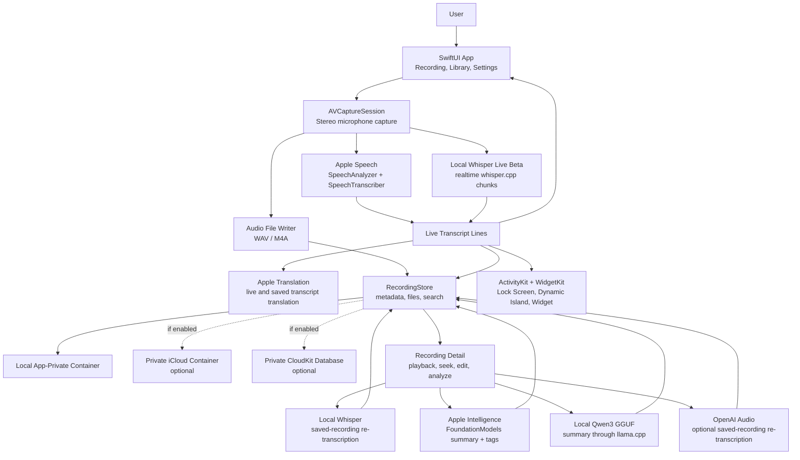

# LiveTranscriber

<p align="center">
  
</p>

<p align="center">
  <a href="README.zh-CN.md">简体中文</a> · <strong>English</strong> ·
  <a href="https://testflight.apple.com/join/gsu9xa9k">TestFlight Beta</a>
</p>

<p align="center">
  
  
  
  
</p>

LiveTranscriber is a local-first iOS recording app built around one workflow: record on your iPhone, read the transcript as it appears, translate the text while recording, then turn saved audio into searchable notes with local transcription, summaries, and tags.

It uses Apple Speech for the default live transcription path, supports optional Local Whisper for offline high-accuracy re-transcription, and can generate summaries and topic tags with Apple Intelligence or a downloaded Qwen3 1.7B Q4 GGUF model through embedded llama.cpp. This makes it useful on devices where Apple Intelligence is unavailable, including China-region iPhones and other unsupported configurations.

## Highlights

| Moment | What LiveTranscriber does |
| --- | --- |
| While recording | Saves audio and shows live transcript lines immediately. |
| While listening | Translates confirmed transcript text with Apple's Translation framework. |
| After recording | Re-transcribes saved audio with Apple Speech, Local Whisper, or optional OpenAI. |
| For notes | Generates summaries and tags with Apple Intelligence or local Qwen3. |
| For recall | Searches names, languages, transcript text, summaries, and tags. |
| For privacy | Keeps recordings local by default, with optional private iCloud sync. |

## Core Workflow

1. **Record and transcribe live.** Start recording, choose language and WAV/M4A format from the recorder, and watch transcript lines appear as the audio is captured.
2. **Translate during recording.** Use live transcript translation for confirmed lines while the recording is still running.
3. **Save a structured recording.** Add a title, manual tags, generated title/tags, and optional location metadata.
4. **Improve the transcript locally.** After recording, choose Local Whisper and select any downloaded model for higher-accuracy offline re-transcription.
5. **Summarize on device.** Use Apple Intelligence when available, or use local Qwen3 summaries and tags when Apple Intelligence is not available.
6. **Search later.** Find recordings by file name, language, transcript body, summary, or tags.

## Current Features

### Recording

- Native SwiftUI app with Recording, Recordings, and Settings tabs.
- Stereo Capture using `AVCaptureSession` and `AVCaptureDeviceInput.multichannelAudioMode = .stereo`.
- WAV and M4A output, configurable from the recorder card and Settings.
- Pause/resume, elapsed timer, input status, Live Activity, Dynamic Island, and Home Screen widget support.
- Consistent haptic feedback for primary actions, menus, navigation, analysis, playback, and blocked states.

### Transcription and Translation

- Default Apple Speech live transcription through `SpeechAnalyzer` and `SpeechTranscriber`.
- Optional Local Whisper Live beta for offline realtime transcription with a selected downloaded model.
- Import audio from Files or the iOS share/Open In menu.
- Offline imported-audio transcription with progress and failure states.
- Saved-recording re-transcription with Apple Speech, Local Whisper, or OpenAI.
- Live and saved transcript translation using Apple's Translation framework.

### Saved Recordings

- Timestamped transcript lines that can seek playback.
- Recording detail view with playback controls, transcript seek, translation, copy, share, edit, lock/unlock, delete, and audio parameter inspection.
- Recording map for recordings saved with location metadata.
- Search across file names, languages, transcript previews, full transcript text, summaries, and tags.
- Local app-private storage by default, with optional app-private iCloud file sync and private CloudKit index sync.

### Intelligence

- Selectable summary engine: Automatic, Apple Intelligence, or Local Qwen3.
- Tap Analyze to use the Settings default; long-press Analyze to choose a provider for that run.
- Local Qwen3 1.7B Q4_K_M GGUF summaries and tags through embedded llama.cpp.
- Summary model download/delete controls in Settings.
- Save-sheet title/tag generation for new recordings.

### Model Options

- Local Whisper saved-recording re-transcription can choose from downloaded models per run.
- Local Whisper model families: Tiny, Base, Small, Medium, Large v3 Turbo Q5, Large v3 Q5, and Large v3.
- Optional Core ML encoder downloads for Local Whisper model acceleration.
- Local Qwen summary model: `Qwen_Qwen3-1.7B-Q4_K_M.gguf`.

## Why Local Qwen Matters

Apple Intelligence is not available on every iPhone, region, language, or OS configuration. LiveTranscriber keeps summaries usable by adding a local Qwen3 path:

- The transcript stays on the phone.
- The model runs through embedded llama.cpp.
- Summary and tags work without Apple Intelligence after the GGUF model is downloaded.
- This is especially helpful for China-region iPhones and other devices where Apple Intelligence is unavailable.

## How It Works



## Transcription Paths

| Path | Use case | Network behavior |
| --- | --- | --- |
| Apple Speech | Default live transcription, import transcription, Apple re-transcription | On-device Apple system framework |
| Local Whisper Live beta | Offline realtime transcription with a selected Whisper model | On-device after model download |
| Local Whisper saved-recording | Higher-accuracy offline pass after recording | On-device after model download |
| OpenAI saved-recording | Optional cloud transcription with the user's own API key | Uploads only when explicitly selected |

## Summary Paths

| Engine | Use case | Notes |
| --- | --- | --- |
| Automatic | Best available local option | Apple Intelligence first, then Local Qwen if installed |
| Apple Intelligence | System FoundationModels summary and tags | Requires device and region availability |
| Local Qwen3 | Local summaries on unsupported devices | Uses `Qwen_Qwen3-1.7B-Q4_K_M.gguf` with embedded llama.cpp |

## Supported Languages

Apple live transcription, imported-audio transcription, and Apple Speech re-transcription use the languages returned by `AppleSpeechTranscriptionSupport.supportedLanguages()` on the current device. The fallback list shown before the system list loads includes English, Simplified Chinese, Traditional Chinese, Japanese, Korean, French, German, and Spanish.

Local Whisper uses model-specific language support:

- English-only models expose English only.
- Multilingual models expose Whisper's multilingual language list.

OpenAI saved-recording transcription uses the saved recording's current language ID when sending the request.

## Storage and Sync

- Local app-private storage is the default.
- Optional iCloud storage moves app-managed audio and transcript files into an app-private iCloud container.
- Recording metadata uses SwiftData locally by default.
- When iCloud storage is enabled, metadata syncs through the user's private CloudKit database.
- Downloaded Whisper, Core ML encoder, and Qwen model files are excluded from iCloud backup.

## Requirements

- Xcode beta with the iOS 27 SDK.
- iOS 26 or later device or simulator for development.
- iOS 27 is required for the Native Speech Pipeline mode.
- Apple Speech availability on the target device.
- FoundationModels availability for Apple Intelligence summaries.
- Embedded whisper.cpp runtime for Local Whisper.
- Embedded llama.cpp runtime for Local Qwen summaries.
- iCloud capability configured for `iCloud.com.iamwilliamli.LiveTranscriber` when testing sync.

## Build

```sh
/Applications/Xcode-beta.app/Contents/Developer/usr/bin/xcodebuild \
  -quiet \
  -project LiveTranscriber.xcodeproj \
  -scheme LiveTranscriber \
  -destination 'generic/platform=iOS' \
  -derivedDataPath /tmp/LiveTranscriberDerivedData \
  CODE_SIGNING_ALLOWED=NO \
  build
```

For device testing, open `LiveTranscriber.xcodeproj` in Xcode and use a signing team with the iCloud and Live Activity capabilities enabled.

## Project Structure

- `LiveTranscriber/`: Main iOS app target.
- `LiveTranscriberWidget/`: ActivityKit widget extension for Lock Screen and Dynamic Island.
- `Vendor/`: Embedded whisper.cpp and llama.cpp XCFrameworks.
- `docs/`: Focused engineering documents.
- `DEVELOPMENT_NOTES.md`: Long-form development log and implementation notes.

## Documentation

- [Documentation Index](docs/README.md)
- [Current Product and UI Design](docs/CURRENT_DESIGN.md)
- [Recording Processing Pipeline](docs/RECORDING_PIPELINE.md)
- [Live Activity Design](docs/LIVE_ACTIVITY.md)
- [Localization](docs/LOCALIZATION.md)
- [Development Notes](DEVELOPMENT_NOTES.md)

## Community

- [TestFlight Beta](https://testflight.apple.com/join/gsu9xa9k)
- [Contributing Guide](CONTRIBUTING.md)
- [Code of Conduct](CODE_OF_CONDUCT.md)
- [Security Policy](SECURITY.md)
- [Bug Reports](https://github.com/iamwilliamli/LiveTranscriber/issues/new?template=bug_report.md)
- [Feature Requests](https://github.com/iamwilliamli/LiveTranscriber/issues/new?template=feature_request.md)

## Source Availability and Commercial Attribution

LiveTranscriber is source-available under the [LiveTranscriber Source Available License 1.0](LICENSE). The code is public so people can learn from it, fork it, and continue development.

This is not an OSI-approved open-source license because commercial forks have an attribution requirement. Commercial apps, services, forks, or derivative products based on this project must include visible in-app attribution:

```text
Based on LiveTranscriber by William Li
Original project: https://github.com/iamwilliamli/LiveTranscriber
```

Attribution-free, private-label, or white-label commercial use requires separate written permission from William Li. See [LICENSE](LICENSE), [NOTICE](NOTICE), and [CONTRIBUTING.md](CONTRIBUTING.md) for the full terms.

## Third-Party Licenses

Reddit Sans is included under the SIL Open Font License, Version 1.1. whisper.cpp and llama.cpp are included under the MIT License. Optional Whisper GGML models and the optional Qwen3 GGUF summary model are downloaded on demand from Hugging Face repositories controlled by their respective model publishers. See [LiveTranscriber/Fonts/OFL.txt](LiveTranscriber/Fonts/OFL.txt) and [NOTICE](NOTICE).

## Apple Developer References

- [Speech framework](https://developer.apple.com/documentation/speech)
- [SpeechAnalyzer](https://developer.apple.com/documentation/speech/speechanalyzer)
- [SpeechTranscriber](https://developer.apple.com/documentation/speech/speechtranscriber)
- [AnalyzerInputConverter](https://developer.apple.com/documentation/speech/analyzerinputconverter)
- [AVCaptureSession](https://developer.apple.com/documentation/avfoundation/avcapturesession)
- [AVCaptureDeviceInput](https://developer.apple.com/documentation/avfoundation/avcapturedeviceinput)
- [ActivityKit](https://developer.apple.com/documentation/activitykit)
- [Foundation Models](https://developer.apple.com/documentation/foundationmodels)
- [Translation](https://developer.apple.com/documentation/translation)

## Privacy Model

LiveTranscriber is built around local processing by default.

- Live recording does not use developer-operated transcription servers, third-party analytics, ads, tracking, or custom network requests.
- Apple Speech, Apple Translation, and Apple Intelligence use Apple system frameworks.
- Local Whisper transcription runs on device after the user downloads or bundles a model.
- Local Qwen summaries run on device through embedded llama.cpp after the user downloads or bundles the GGUF model.
- OpenAI is used only when the user manually chooses OpenAI transcription for a saved recording; that audio is sent directly from the iPhone to OpenAI with the user's own API key.
- Files are stored in the local app-private container by default.
- Optional iCloud sync uses the user's app-private iCloud container and CloudKit private database.
- The camera is not used for photos or video. `NSCameraUsageDescription` is present because Apple static review requires it when the app uses `AVCaptureSession` / `AVCaptureDeviceInput` for microphone recording.
