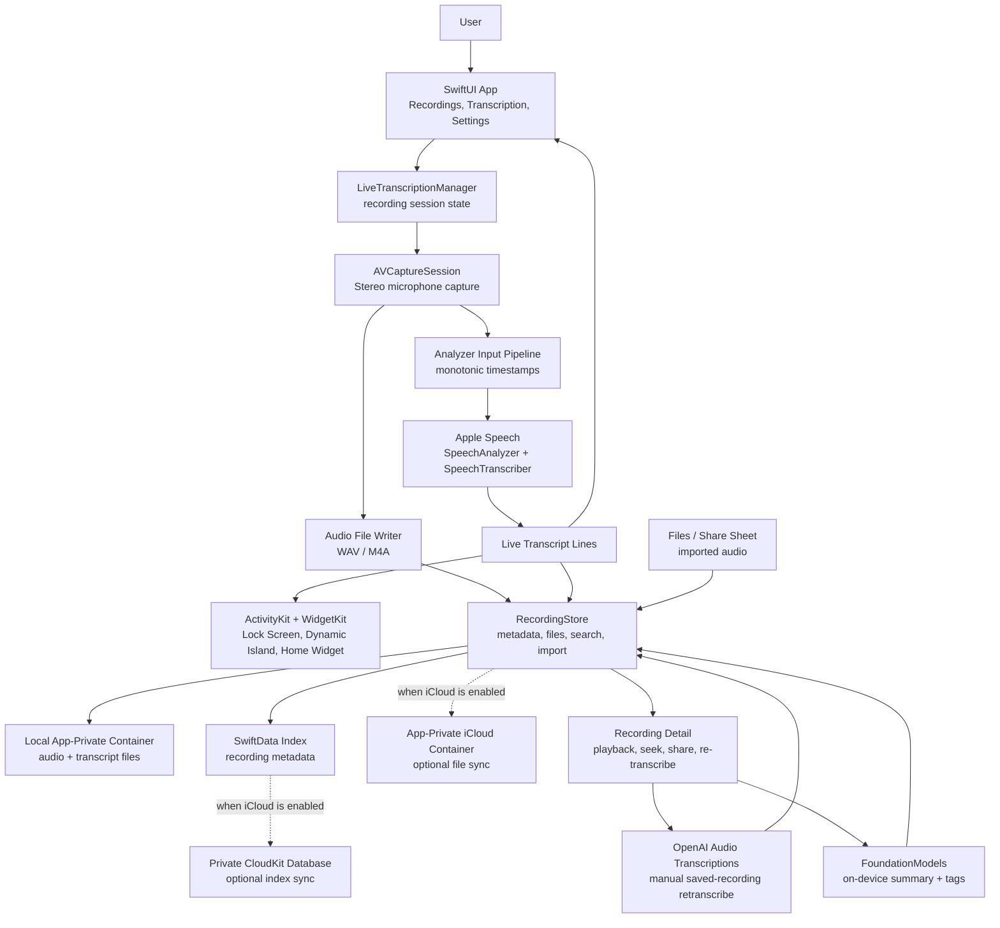

# LiveTranscriber


LiveTranscriber is an iOS 26+ recording and live transcription app. It records audio, transcribes live speech on device with Apple's Speech APIs, saves audio and transcript files, and keeps recording status visible through Lock Screen Live Activities and Dynamic Island.

The project is designed as a native, local-first iOS utility. Audio, transcripts, and the recording index stay in the local app-private container by default. Users can enable iCloud in Settings to move storage into an app-private iCloud container for cross-device sync. Users can also manually re-transcribe saved recordings with OpenAI file transcription using their own API key.

## Source Availability and Commercial Attribution

LiveTranscriber is source-available under the [LiveTranscriber Source Available License 1.0](LICENSE). The code is public so people can learn from it, fork it, and continue development.

This is not an OSI-approved open-source license because commercial forks have an attribution requirement. Commercial apps, services, forks, or derivative products based on this project must include visible in-app attribution:

```text
Based on LiveTranscriber by William Li
Original project: https://github.com/iamwilliamli/LiveTranscriber
```

Attribution-free, private-label, or white-label commercial use requires separate written permission from William Li. See [LICENSE](LICENSE), [NOTICE](NOTICE), and [CONTRIBUTING.md](CONTRIBUTING.md) for the full terms.

## Community and Reporting

- [Contributing Guide](CONTRIBUTING.md)
- [Code of Conduct](CODE_OF_CONDUCT.md)
- [Security Policy](SECURITY.md)
- [Bug Reports](https://github.com/iamwilliamli/LiveTranscriber/issues/new?template=bug_report.md)
- [Feature Requests](https://github.com/iamwilliamli/LiveTranscriber/issues/new?template=feature_request.md)

## Current Features

- Tab-based SwiftUI app with recording, file library, and settings areas.
- Live recording with real-time transcript updates, pause/resume, elapsed timer, and haptic feedback.
- Save sheet after stopping a recording, with editable name, manual tags, duration, and optional location attachment.
- WAV and M4A recording output.
- Stereo Capture recording with `AVCaptureSession` and `AVCaptureDeviceInput.multichannelAudioMode = .stereo`.
- Offline transcription for imported audio files, with language selection and progress/failure state.
- Import from Files or the iOS share/Open In menu for audio recordings such as Voice Memos exports.
- Re-transcription of saved recordings with any supported Speech locale.
- Local app-private storage by default, with an optional Settings-controlled app-private iCloud container for audio, transcript, and recording-index sync.
- Recording map view for recordings that were saved with location metadata.
- Search across file names, languages, transcript previews, full transcript text, summaries, and topic tags.
- Timestamped transcript lines for playback seeking.
- Saved recording detail view with audio playback, transcript seek, copy, and share actions.
- Lock Screen and Dynamic Island Live Activity with elapsed time, latest final transcript, language, line count, and stop action.
- Home Screen widget with quick links to recording, saved files, and settings.
- Local Apple Intelligence summary and topic tag generation for saved transcripts.
- Selectable speech processing pipelines: a stable iOS 26/27 compatible pipeline and an iOS 27 native `AnalyzerInputConverter` pipeline.
- Optional OpenAI re-transcription for saved recordings, with long-form and segmented modes using a user-supplied OpenAI API key stored in Keychain.
- Recording detail audio parameters, including sample rate, channel count, encoding, duration, frame count, and file size.
- Shared visual system based on Reddit Sans, grouped backgrounds, compact card surfaces, red recording actions, and system SF Symbols.
- English, Simplified Chinese, Traditional Chinese, German, Dutch, and Japanese localization.

## How It Works

LiveTranscriber is a local-first iOS app. The main recording path captures stereo audio once, writes that audio to a file, and downmixes the same live sample buffers into the local Apple Speech pipeline for real-time transcripts. Saved recordings, transcript text, search metadata, summaries, and tags stay in the app-private container by default. If the user enables iCloud, app-managed files move to the app-private iCloud container and the SwiftData index syncs through the user's private CloudKit database.



## Recording Capture Mode

LiveTranscriber uses Stereo Capture as its only live microphone capture path.

The recorder uses `AVCaptureSession`, sets `AVCaptureDeviceInput.multichannelAudioMode = .stereo`, writes a stereo file, and downmixes the same captured sample buffers to mono before feeding SpeechAnalyzer.

Stereo Capture only works when the active capture input supports AVCapture stereo mode. On current Apple APIs this mode is intended for the built-in microphone; external microphones may not honor it.

## Speech Pipeline Modes

LiveTranscriber exposes the active speech pipeline in Settings > Developer Options.

- Compatible Pipeline: available on iOS 26 and iOS 27. Uses `SpeechTranscriber` with `preset: .timeIndexedProgressiveTranscription`, `SpeechAnalyzer.Options(priority: .userInitiated, modelRetention: .whileInUse)`, `ignoresResourceLimits: true` on iOS 27, `AVAudioConverter`, and fixed analyzer input `16 kHz / mono / Int16 PCM`.
- iOS 27 Native Pipeline: available on iOS 27. Uses `SpeechTranscriber` with `preset: .timeIndexedProgressiveTranscription`, `SpeechAnalyzer.Options(priority: .userInitiated, modelRetention: .whileInUse, ignoresResourceLimits: true)`, `AnalyzerInputConverter.converter(compatibleWith: modules)`, and `SpeechAnalyzer.prepareToAnalyze(in: nil)` so the system chooses the compatible input format.

Both live pipelines use a monotonic audio timeline for `AnalyzerInput.bufferStartTime` so transcript timestamps stay stable across iOS 26 and iOS 27.

## Optional OpenAI Saved-Recording Transcription

Live recording uses Apple on-device Speech only. For saved recordings, the recording detail menu can manually run OpenAI file transcription when the user needs a higher-accuracy pass for difficult languages, accents, or domain vocabulary.

OpenAI transcription uses a bring-your-own-key setup in Settings. The user enters their own OpenAI API key, the key is stored in iOS Keychain, and the iPhone uploads the selected saved recording directly to OpenAI only when the user chooses an OpenAI re-transcription action. Long-form mode uses `gpt-4o-transcribe`; segmented mode uses `whisper-1` with segment timestamps.

## Requirements

- Xcode beta with the iOS 27 SDK.
- iOS 26 or later device or simulator for development.
- iOS 27 is required for the Native Pipeline mode.
- Apple Speech and FoundationModels availability on the target device.
- iCloud capability configured for `iCloud.com.iamwilliamli.LiveTranscriber`, with CloudDocuments for private file sync and CloudKit for private SwiftData index sync.

## Build

```sh
/Applications/Xcode-beta.app/Contents/Developer/usr/bin/xcodebuild \
  -quiet \
  -project LiveTranscriber.xcodeproj \
  -scheme LiveTranscriber \
  -destination 'generic/platform=iOS' \
  -derivedDataPath /tmp/LiveTranscriberDerivedData \
  CODE_SIGNING_ALLOWED=NO \
  build
```

For device testing, open `LiveTranscriber.xcodeproj` in Xcode and use a signing team with the iCloud and Live Activity capabilities enabled.

## Project Structure

- `LiveTranscriber/`: Main iOS app target.
- `LiveTranscriberWidget/`: ActivityKit widget extension for Lock Screen and Dynamic Island.
- `LiveTranscriber.xcodeproj/`: Xcode project and shared scheme.
- `docs/`: Focused engineering documents.
- `DEVELOPMENT_NOTES.md`: Long-form development log and implementation notes.

## Documentation

- [Documentation Index](docs/README.md)
- [Current Product and UI Design](docs/CURRENT_DESIGN.md)
- [Recording Processing Pipeline](docs/RECORDING_PIPELINE.md)
- [Live Activity Design](docs/LIVE_ACTIVITY.md)
- [Localization](docs/LOCALIZATION.md)
- [Development Notes](DEVELOPMENT_NOTES.md)

## Third-Party Licenses

Reddit Sans is included under the SIL Open Font License, Version 1.1. The font may be bundled with commercial software under the OFL terms. See [LiveTranscriber/Fonts/OFL.txt](LiveTranscriber/Fonts/OFL.txt) and [NOTICE](NOTICE).

## Apple Developer References

- [Speech framework](https://developer.apple.com/documentation/speech)
- [SpeechAnalyzer](https://developer.apple.com/documentation/speech/speechanalyzer)
- [SpeechTranscriber](https://developer.apple.com/documentation/speech/speechtranscriber)
- [AnalyzerInputConverter](https://developer.apple.com/documentation/speech/analyzerinputconverter)
- [AVCaptureSession](https://developer.apple.com/documentation/avfoundation/avcapturesession)
- [AVCaptureDeviceInput](https://developer.apple.com/documentation/avfoundation/avcapturedeviceinput)
- [AVAudioConverter](https://developer.apple.com/documentation/avfaudio/avaudioconverter)
- [ActivityKit](https://developer.apple.com/documentation/activitykit)
- [Foundation Models](https://developer.apple.com/documentation/foundationmodels)

## Privacy Model

LiveTranscriber is built around local processing by default. Live recording, live transcription, summary, and tagging use Apple system frameworks on device.

- Live recording does not use developer-operated transcription servers, third-party analytics, ads, tracking, or custom network requests.
- OpenAI is used only when the user manually chooses OpenAI transcription for a saved recording; that recording audio is sent directly from the iPhone to OpenAI.
- OpenAI transcription stores the user's own OpenAI API key in Keychain and uses it directly from the device.
- Files are stored in the local app-private container by default. When iCloud storage is enabled in Settings, app-managed recording files sync through an app-private iCloud container instead of a visible iCloud Drive folder.
- Recording metadata is stored with SwiftData locally by default. When iCloud storage is enabled, it syncs through the user's CloudKit private database.
- The camera is not used for photos or video. `NSCameraUsageDescription` is present because Apple static review requires it when the app uses `AVCaptureSession` / `AVCaptureDeviceInput` for microphone recording.
