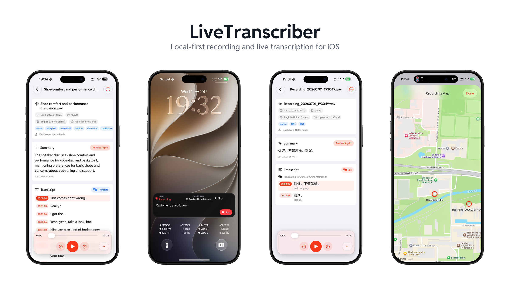
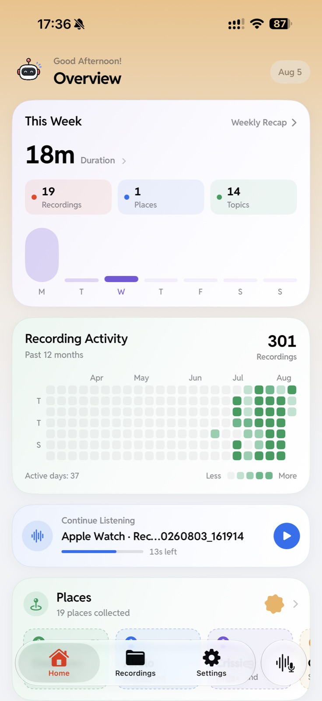
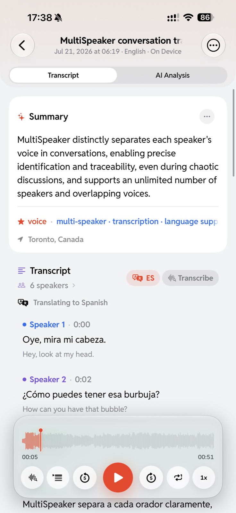
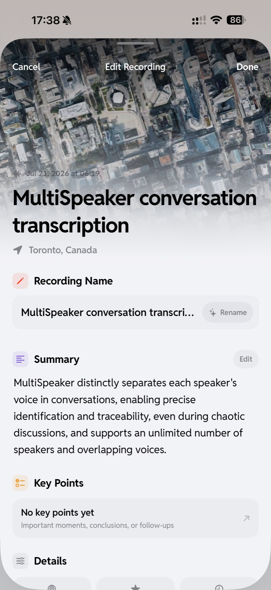

# LiveTranscriber

<p align="center">
  
</p>

<p align="center">
  <a href="README.zh-CN.md">简体中文</a> · <strong>English</strong> ·
  <a href="https://apps.apple.com/app/id6785515364">App Store</a> ·
  <a href="https://testflight.apple.com/join/gsu9xa9k">TestFlight Beta</a>
</p>

<p align="center">
  
  
  
  
</p>

> [!NOTE]
> This is the public showcase and stable foundation for the App Store version of LiveTranscriber. Active product development and release automation continue privately. Issues and support remain available here.

LiveTranscriber is a local-first recorder and transcription workspace for iPhone and Apple Watch. It captures audio, creates live captions, translates transcripts, separates speakers, and turns saved recordings into searchable notes and meeting intelligence. Most workflows can stay entirely on device; cloud processing is opt-in and uses the user's own API key.

## App Preview

<p align="center">
  
  
  
</p>

<p align="center">
  Overview and recall · Multi-speaker transcript · Recording intelligence
</p>

## What the App Does

| Moment | LiveTranscriber |
| --- | --- |
| During capture | Records WAV or M4A audio and shows timestamped live captions. |
| In a conversation | Optionally assigns stable labels to as many as four live speakers with on-device Sortformer. |
| Across languages | Translates live or saved transcript lines with Apple Translation and keeps the original text beside the translation. |
| After recording | Re-transcribes locally with Apple Speech, Nemotron, Qwen3-ASR, Whisper, or MOSS multi-speaker. |
| For understanding | Creates summaries, tags, meeting notes, action items, decisions, open questions, and recording Q&A. |
| For recall | Searches transcripts and metadata, tracks topics and places, and resurfaces recent or unfinished recordings. |

## Recording and Live Captions

- Native SwiftUI recorder with stereo microphone capture, WAV/M4A output, pause/resume, waveform levels, background recording, and configurable language and audio quality.
- Lock Screen Live Activity, Dynamic Island status, Home Screen widgets, Shortcuts/App Intents, and a persistent recording control while moving around the app.
- Import from Files or the iOS share/Open In flow, with progress, cancellation, checkpoint recovery, and continued-processing support for long local jobs.
- Optional system/other-app audio captioning with a floating Picture in Picture caption window where the OS and device support it.

The live engine can be left on **Automatic** or selected explicitly:

| Live engine | Role |
| --- | --- |
| Apple Speech | Private system transcription through `SpeechAnalyzer` and `SpeechTranscriber`. |
| Nemotron 3.5 Streaming | Recommended fast offline engine; incrementally processes new 320 ms chunks. |
| Qwen3-ASR Live | Experimental on-device multilingual live transcription. |
| Local Whisper Live | Experimental whisper.cpp live path, where available. |

Automatic mode prefers Apple Speech for supported languages and falls back to Nemotron when appropriate. Live speaker separation is independent of the speech recognizer: the optional NVIDIA Sortformer Core ML model can add stable labels for up to four speakers alongside any live engine.

## Saved Recordings

- Tap a transcript line to seek the synchronized waveform player; use ±5 seconds, repeat-one, speed, and transcript-follow controls while listening.
- Re-transcribe the original audio without losing the restorable previous transcript.
- Use local **MOSS Transcribe Diarize** to produce timestamped, color-coded multi-speaker turns, or use Qwen3-ASR, Nemotron, Apple Speech, and downloaded Whisper models for other accuracy/speed tradeoffs.
- Translate a saved transcript while retaining the source text, then copy or export TXT, Markdown, SRT, VTT, or JSON.
- Edit the title, summary, key points, category, tags, speakers, transcript lines, language, and location metadata.
- Search file names, transcript previews and full text, languages, summaries, key points, meeting analysis, categories, locations, and tags.

## Intelligence and Personal Recall

- **Recording Intelligence:** summaries and topic tags through Apple Intelligence, local Qwen3, or an explicitly selected Gemini Cloud run.
- **Meeting Analysis:** structured summary, action items with owners and dates, decisions, open questions, and supporting notes. Action items can be reviewed and added to Apple Reminders.
- **Ask AI:** chat with the context of one saved recording.
- **Overview:** weekly duration and recording/place/topic totals, a 12-month activity heatmap, weekly recap, continue-listening card, collected places, topic ranking, and resurfaced memories.
- **Location-aware library:** optional recording location, map browsing, localized place names, and place-based collections.

Automatic intelligence remains local: it tries Apple Intelligence first and then the downloaded local Qwen3 model. It never silently chooses Gemini.

## Apple Watch

The companion watchOS app records independently, supports pause/resume and recording-quality choices, captures location metadata when allowed, and transfers completed audio to the paired iPhone. Incoming Watch recordings join the same searchable library and can use the iPhone's transcription, translation, speaker separation, and intelligence tools.

## Models and Frameworks

The current app uses the following paths. Downloadable on-device model packs are delivered through Apple-hosted Background Assets and are excluded from iCloud backup.

| Model or framework | Current artifact | Used for | Processing |
| --- | --- | --- | --- |
| Apple Speech | `SpeechAnalyzer` + `SpeechTranscriber` | Live captions, imports, re-transcription | Apple system framework, on device |
| NVIDIA Nemotron | `aufklarer/Nemotron-3.5-ASR-Streaming-0.6B-MLX-8bit` and `aufklarer/Nemotron-3.5-ASR-Streaming-0.6B-CoreML-INT8` | Recommended streaming ASR and local re-transcription | On device |
| Qwen3-ASR | `aufklarer/Qwen3-ASR-0.6B-MLX-4bit` + `aufklarer/Silero-VAD-v6.2.1-MLX` | Multilingual live and saved-audio transcription with timestamps | On device |
| Whisper | Tiny, Base, Small, Medium, Large v3 Turbo Q5, Large v3 Q5, and Large v3 families | Optional live path and saved-audio re-transcription | On device through whisper.cpp |
| NVIDIA Sortformer | `aufklarer/Sortformer-Diarization-CoreML` (4-speaker streaming variant) | Realtime speaker labels alongside any live ASR engine | On device |
| MOSS | `vanch007/mlx-MOSS-Transcribe-Diarize-4bit` | Post-recording transcription, timestamps, and multi-speaker diarization | On device through MLX |
| Apple Intelligence | Foundation Models framework | Summaries, tags, meeting analysis, and recording chat | Apple system model, on device |
| Qwen3 | `Qwen_Qwen3-1.7B-Q4_K_M.gguf` | Local summaries, tags, meeting analysis, and chat when Apple Intelligence is unavailable | On device through llama.cpp |
| Gemini | `gemini-3.5-flash` | Optional verbatim multi-speaker processing and intelligence | Cloud, user API key, explicit opt-in |

Model availability can vary by App Store storefront, device capability, OS version, and language. In particular, Gemini Cloud and some third-party paths are hidden where regional distribution rules require it.

## Privacy and Storage

- Recordings, transcripts, indexes, and intelligence results use app-private local storage by default.
- Optional iCloud sync uses the user's private app container and private CloudKit database.
- There are no developer-operated transcription servers, ads, third-party analytics, or tracking in the default workflow.
- Apple Speech, Translation, and Foundation Models use Apple system frameworks.
- Nemotron, Qwen3-ASR, Whisper, Sortformer, MOSS, and the Qwen3 summary model run locally after their model pack is available.
- Gemini is used only after the user enables it, supplies an API key, and explicitly chooses a Gemini action. Requests set `store: false`; temporary uploaded audio is deleted on a best-effort basis after processing.

## Requirements

- iOS 26 or later; some native speech and system-audio features require iOS 27.
- watchOS 26 or later for the Apple Watch companion.
- Xcode with the matching iOS SDK to build the public foundation.
- Device, language, storefront, and model availability requirements apply to individual engines.

## Build

```sh
/Applications/Xcode-beta.app/Contents/Developer/usr/bin/xcodebuild \
  -quiet \
  -project LiveTranscriber.xcodeproj \
  -scheme LiveTranscriber \
  -destination 'generic/platform=iOS' \
  -derivedDataPath /tmp/LiveTranscriberDerivedData \
  CODE_SIGNING_ALLOWED=NO \
  build
```

For device testing, open `LiveTranscriber.xcodeproj` in Xcode and use a signing team with the iCloud and Live Activity capabilities enabled.

## Project Structure

- `LiveTranscriber/`: Main iOS app target.
- `LiveTranscriberWidget/`: ActivityKit widget extension for Lock Screen and Dynamic Island.
- `Vendor/`: Embedded whisper.cpp and llama.cpp XCFrameworks.
- `docs/`: Focused engineering documents.
- `DEVELOPMENT_NOTES.md`: Long-form development log and implementation notes.

## Documentation

- [Documentation Index](docs/README.md)
- [Current Product and UI Design](docs/CURRENT_DESIGN.md)
- [Recording Processing Pipeline](docs/RECORDING_PIPELINE.md)
- [Live Activity Design](docs/LIVE_ACTIVITY.md)
- [Localization](docs/LOCALIZATION.md)
- [Development Notes](DEVELOPMENT_NOTES.md)

## Community

- [Download on the App Store](https://apps.apple.com/app/id6785515364)
- [TestFlight Beta](https://testflight.apple.com/join/gsu9xa9k)
- [Contributing Guide](CONTRIBUTING.md)
- [Code of Conduct](CODE_OF_CONDUCT.md)
- [Security Policy](SECURITY.md)
- [Bug Reports](https://github.com/iamwilliamli/LiveTranscriber/issues/new?template=bug_report.md)
- [Feature Requests](https://github.com/iamwilliamli/LiveTranscriber/issues/new?template=feature_request.md)

## Source Availability and Commercial Attribution

The public LiveTranscriber foundation is source-available under the [LiveTranscriber Source Available License 1.0](LICENSE). The code is available so people can study it, fork it, and build on the published baseline.

This is not an OSI-approved open-source license because commercial forks have an attribution requirement. Commercial apps, services, forks, or derivative products based on this project must include visible in-app attribution:

```text
Based on LiveTranscriber by William Li
Original project: https://github.com/iamwilliamli/LiveTranscriber
```

Attribution-free, private-label, or white-label commercial use requires separate written permission from William Li. See [LICENSE](LICENSE), [NOTICE](NOTICE), and [CONTRIBUTING.md](CONTRIBUTING.md) for the full terms.

## Third-Party Licenses

Reddit Sans is included under the SIL Open Font License, Version 1.1. whisper.cpp and llama.cpp are included under the MIT License. Downloadable Whisper, Nemotron, Qwen3-ASR/VAD, Sortformer, MOSS, and Qwen3 GGUF artifacts come from the publishers named above and are attributed in the app's third-party model license catalog. User-facing model packs are delivered through Apple-hosted Background Assets. See [LiveTranscriber/Fonts/OFL.txt](LiveTranscriber/Fonts/OFL.txt) and [NOTICE](NOTICE) for the public foundation's bundled notices.

## Apple Developer References

- [Speech framework](https://developer.apple.com/documentation/speech)
- [SpeechAnalyzer](https://developer.apple.com/documentation/speech/speechanalyzer)
- [SpeechTranscriber](https://developer.apple.com/documentation/speech/speechtranscriber)
- [AnalyzerInputConverter](https://developer.apple.com/documentation/speech/analyzerinputconverter)
- [AVCaptureSession](https://developer.apple.com/documentation/avfoundation/avcapturesession)
- [AVCaptureDeviceInput](https://developer.apple.com/documentation/avfoundation/avcapturedeviceinput)
- [ActivityKit](https://developer.apple.com/documentation/activitykit)
- [Foundation Models](https://developer.apple.com/documentation/foundationmodels)
- [Translation](https://developer.apple.com/documentation/translation)
