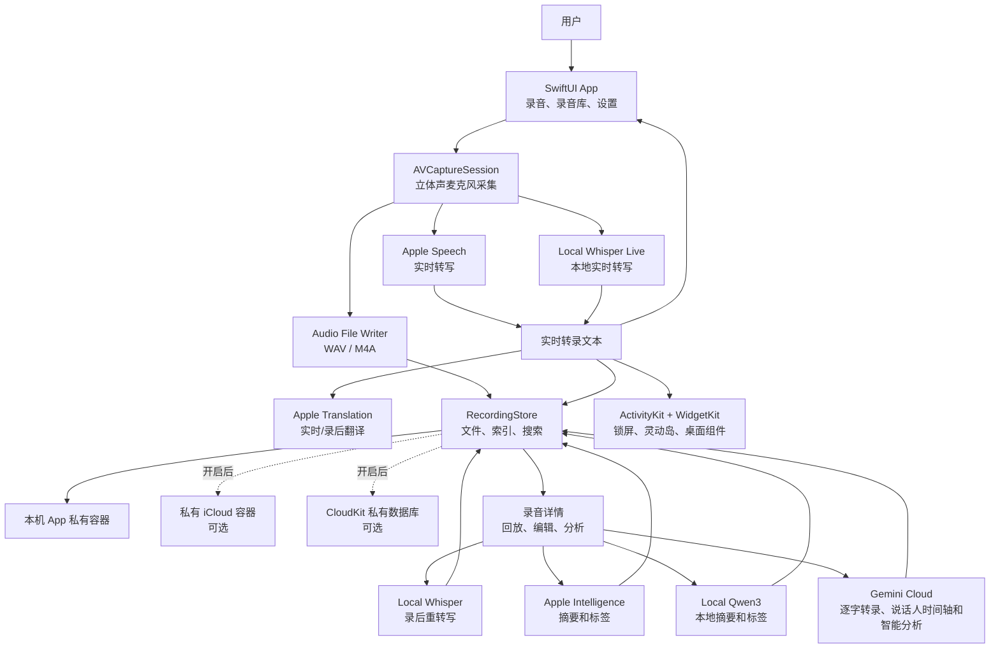

# LiveTranscriber

<p align="center">
  
</p>

<p align="center">
  <strong>简体中文</strong> · <a href="README.md">English</a> ·
  <a href="https://testflight.apple.com/join/gsu9xa9k">TestFlight 测试版</a>
</p>

<p align="center">
  
  
  
  
</p>

LiveTranscriber 是一个本地优先的录音转写项目。当前发布产品是 iPhone app：一边录音一边转录，录音过程中实时翻译；录完以后可以在本机重新转写、总结和打标签，再通过搜索快速找回内容。同一个 repo 里也在开发原生 macOS 版本，用于录制会议窗口、系统声音和麦克风。

录音、转写、摘要、标签、回放和搜索都优先在本机完成；如果设备支持 Apple Intelligence，可以用系统模型总结；如果设备没有 Apple Intelligence，也可以下载 Qwen3 1.7B Q4 GGUF 模型，在手机上生成摘要和标签。这个设计对国行 iPhone 和其他无法使用 Apple Intelligence 的设备更友好。

## 适合什么场景

| 场景 | LiveTranscriber 的作用 |
| --- | --- |
| 上课、会议、访谈 | 录音同时实时转写，不用等录完再处理。 |
| 外语内容 | 录音过程中翻译已确认的转录文本。 |
| 录音质量复杂 | 录完用本地 Whisper 大模型重新转写，提高准确度。 |
| 想快速回顾 | 用 Apple Intelligence、本地 Qwen3 或明确选择的 Gemini 云端生成摘要和主题标签。 |
| 录音很多 | 搜索录音名、语言、正文、摘要和标签。 |
| 重视隐私 | 默认本机私有存储，可选私有 iCloud 同步。 |

## 核心流程

1. **开始录音。** 在首页选择转录语言和 WAV/M4A 格式，开始录音后实时看到转录文本。
2. **边录边翻译。** 录音过程中可以对已确认的转录文本做实时翻译。
3. **保存录音。** 录完后可以编辑标题、添加标签、生成标题/标签，并可选择保存位置 metadata。
4. **本地高精度重转录。** 对已保存录音选择 Local Whisper，指定已下载的模型和语言，离线生成更准确的转录。
5. **本地总结和打标签。** 支持 Apple Intelligence，也支持本地 Qwen3。没有 Apple Intelligence 的设备也能生成摘要和标签。
6. **搜索和回放。** 按文件名、语言、全文、摘要、标签搜索；点转录时间戳即可跳到对应录音位置。

## 功能亮点

### 原生 macOS 版本

- 原生 SwiftUI macOS app，不是 Catalyst 包装。
- 使用 ScreenCaptureKit 系统选择器录制显示器、某个 app 或单独会议窗口，不绑定 Zoom、Teams、Meet 等具体平台。
- 最高 4K/30 fps H.264 MP4，并分别保留系统声音和麦克风 AAC 音轨。
- 使用与 iOS 共用的版本化多资源录音 manifest。
- 可读取和播放共享 iCloud 录音库；iCloud 不可用时回退到 Application Support，也支持授权读取用户选择的文件夹。

### 录音

- SwiftUI 原生 iOS app，包含录音、录音库和设置三个主要区域。
- 首页可以直接切换转录语言和录音格式。
- 支持 WAV / M4A 输出。
- 使用 `AVCaptureSession` Stereo Capture 保存立体声录音，并给转写管线提供单声道输入。
- 支持暂停、继续、计时、录音状态、触觉反馈、锁屏 Live Activity、Dynamic Island 和 Home Screen Widget。

### 实时转写和翻译

- 默认使用 Apple Speech 做本机实时转写。
- 可选 Local Whisper Live beta，用已下载的 Whisper 模型离线实时转写。
- 转录过程中可以使用 Apple Translation 翻译已确认的文本行。
- 支持从文件或系统分享入口导入音频。
- 导入音频可以离线转写，并显示进度和失败状态。

### 录完后的处理

- 用 Apple Speech 重新转写。
- 用 Local Whisper 选择已下载模型做本地高精度重转写。
- 可选使用自己的 Gemini API Key：确认上传原始音频和当前转录草稿后，生成逐字转录、时间戳、说话人标签、摘要和会议分析；转录界面用稳定颜色、文字标签和图例区分多位说话人，Gemini 处理前的转录可恢复。
- 录音详情支持回放、倍速、按时间戳跳转、翻译、复制、分享、编辑、锁定/解锁转录、删除和查看音频参数。
- 带位置信息的录音可以在地图中查看。

### 摘要、标签和搜索

- 摘要引擎可选：Automatic、Apple Intelligence、Local Qwen3、Gemini Cloud。
- Intelligence 下提供独立的 Gemini Cloud 子菜单，包含启用开关、钥匙串 API Key、模型名称，以及本机累计的请求、输入、输出、思考、缓存和总 Token 用量。
- 轻点“分析”使用设置里的默认摘要引擎；长按“分析”可以临时选择摘要 provider。
- Local Qwen3 使用 `Qwen_Qwen3-1.7B-Q4_K_M.gguf`，通过内置 llama.cpp 在手机上运行。
- 摘要模型可以在设置里下载和删除。
- 搜索覆盖录音名、语言、转录预览、全文、摘要和标签。

## 对国行 iPhone 更友好

Apple Intelligence 并不是所有地区、设备和系统配置都可用。LiveTranscriber 不把摘要能力完全绑定到 Apple Intelligence：

- 没有 Apple Intelligence 时，可以下载本地 Qwen3 模型。
- 摘要和标签在 iPhone 本机通过 llama.cpp 生成。
- 转录文本不需要上传到开发者服务器。
- 适合国行 iPhone 这类无法使用 Apple Intelligence 的场景。

## 本地模型

| 模型能力 | 用途 | 说明 |
| --- | --- | --- |
| Local Whisper | 离线转录和高精度重转录 | 支持 Tiny、Base、Small、Medium、Large v3 Turbo Q5、Large v3 Q5、Large v3 等模型。 |
| Local Whisper Live beta | 离线实时转写 | 需要单独选择 realtime 模型。 |
| Local Qwen3 | 本地摘要和标签 | 使用 Qwen3 1.7B Q4_K_M GGUF，通过 llama.cpp 运行。 |
| Core ML Encoder | Whisper 加速选项 | 可选下载，对应不同 Whisper 模型。 |

## 架构概览



## 隐私和网络边界

LiveTranscriber 默认按本地优先设计。

- 实时录音不会使用开发者运营的转录服务器。
- 不包含第三方 analytics、广告或 tracking。
- Apple Speech、Apple Translation、Apple Intelligence 使用 Apple 系统框架。
- Local Whisper 在本机运行；只有用户主动下载模型时才会连接 Hugging Face。
- Local Qwen3 在本机通过 llama.cpp 运行；只有用户主动下载 GGUF 模型时才会连接 Hugging Face。
- Gemini 只在用户确认“使用 Gemini 云端处理”，或明确选择 Gemini 做纯文本智能分析时使用。Automatic 始终只选择本地方案；Interactions 请求使用 `store: false`，临时音频上传会在处理后尽力删除。
- 录音文件默认保存在 App 本机私有容器。
- 可选 iCloud 同步使用 App 私有 iCloud 容器和用户的 CloudKit private database。

## 技术要点

- iOS 26+。
- 使用 iOS 27 SDK 构建。
- 原生 macOS app 支持 macOS 15+；录屏和麦克风功能分别需要对应的系统权限。
- Apple Speech 路径使用 `SpeechAnalyzer` 和 `SpeechTranscriber`。
- iOS 27 可选 Native Speech Pipeline。
- Local Whisper 使用 whisper.cpp。
- Local Qwen3 使用 llama.cpp。
- 录音索引使用 SwiftData。
- Live Activity 和 Widget 使用 ActivityKit / WidgetKit。

## 构建

```sh
/Applications/Xcode-beta.app/Contents/Developer/usr/bin/xcodebuild \
  -quiet \
  -workspace LiveTranscriber.xcworkspace \
  -scheme LiveTranscriber \
  -destination 'generic/platform=iOS Simulator' \
  CODE_SIGNING_ALLOWED=NO \
  build

/Applications/Xcode-beta.app/Contents/Developer/usr/bin/xcodebuild \
  -quiet \
  -workspace LiveTranscriber.xcworkspace \
  -scheme LiveTranscriberMac \
  -destination 'platform=macOS,arch=arm64' \
  CODE_SIGNING_ALLOWED=NO \
  test
```

两个命令都使用 Xcode 标准的增量 DerivedData 目录。日常开发请打开 `LiveTranscriber.xcworkspace`。真机测试需要配置 signing team，并启用 iCloud 和 Live Activity 相关 capabilities；macOS App ID 也需要关联现有 iCloud container。

## 项目结构

- `LiveTranscriber/`：主 iOS app target。
- `LiveTranscriberWidget/`：锁屏、灵动岛和桌面组件扩展。
- `LiveTranscriberMac/`：原生 macOS app；工程由目录中的 `project.yml` 生成。
- `Packages/TranscriberDomain/`：跨平台录音模型和平台无关的 service 边界。
- `Vendor/`：内置 whisper.cpp 和 llama.cpp XCFramework。
- `docs/`：工程文档。
- `DEVELOPMENT_NOTES.md`：开发记录和实现细节。

## 文档

- [Documentation Index](docs/README.md)
- [Current Product and UI Design](docs/CURRENT_DESIGN.md)
- [Recording Processing Pipeline](docs/RECORDING_PIPELINE.md)
- [Live Activity Design](docs/LIVE_ACTIVITY.md)
- [Localization](docs/LOCALIZATION.md)
- [Native macOS Architecture](docs/architecture/macos-foundation.md)
- [Continuous Integration](docs/CI.md)
- [Development Notes](DEVELOPMENT_NOTES.md)

## 试用和反馈

- [TestFlight Beta](https://testflight.apple.com/join/gsu9xa9k)
- [Contributing Guide](CONTRIBUTING.md)
- [Code of Conduct](CODE_OF_CONDUCT.md)
- [Security Policy](SECURITY.md)
- [Bug Reports](https://github.com/iamwilliamli/LiveTranscriber/issues/new?template=bug_report.md)
- [Feature Requests](https://github.com/iamwilliamli/LiveTranscriber/issues/new?template=feature_request.md)

## 授权和商业署名

LiveTranscriber 使用 [LiveTranscriber Source Available License 1.0](LICENSE)。代码公开，方便学习、fork 和继续开发。

这不是 OSI 认证的开源许可证，因为商业 fork 有署名要求。任何基于本项目的商业 app、服务、fork 或衍生产品，都必须在 app 内合理可见的位置展示：

```text
Based on LiveTranscriber by William Li
Original project: https://github.com/iamwilliamli/LiveTranscriber
```

如果需要无署名、白标或私有品牌商业使用，需要获得 William Li 的单独书面许可。完整条款见 [LICENSE](LICENSE)、[NOTICE](NOTICE) 和 [CONTRIBUTING.md](CONTRIBUTING.md)。

## 第三方许可

Reddit Sans 使用 SIL Open Font License 1.1。whisper.cpp 和 llama.cpp 使用 MIT License。可选下载的 Whisper GGML 模型和 Qwen3 GGUF 摘要模型来自各自发布者在 Hugging Face 上的仓库。详情见 [LiveTranscriber/Fonts/OFL.txt](LiveTranscriber/Fonts/OFL.txt) 和 [NOTICE](NOTICE)。
